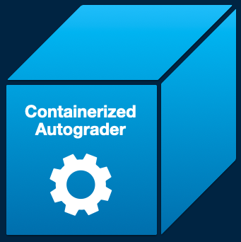
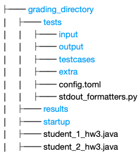

<style>
  body {
    background-color: #00264d;
    border: 5px solid FLoralWhite;
    padding: 2px;
    font-family: "Verdana";
  }

  p {
    color: FLoralWhite;
    font-size: 16px;
  }

  h1 {
    color: FLoralWhite;
    font-size: 24px;
  }

  h2 {
    color: FLoralWhite;
    font-size: 20px;
  }

  ul {
    list-style-type: square;
    color: FLoralWhite;
  }

  li {
    margin-bottom: 8px;
  }

  a {
    text-decoration: underline;
    font-weight: bold;
    color: FloralWhite;
  }

  code {
    background-color: white;
    padding: 4px;
    display: inline-block;
    font-family: "Helvetica", monospace;
    font-weight: bold;
    color: Gray;
  }
</style>


<h1 style="text-align:center;">Containerized Autograding Tool</h1>
<div style="text-align:center;">
  
</div>


<p align="center">
  <b>An easy-to-use autograding tool inside a container</b>
</p>

# Table of Contents

- [Description](#description)
- [Features](#features)
- [Installation](#installation)
- [Use](#use)
- [Tutorial](#tutorial)
- [Testing Files](#testing-files)
- [Common Errors](#common-errors)
- [Reference Information](#reference-information)

## Description
This is an autograding tool that runs inside a Docker container. This tool can be used to grade programming assignments automatically. All that is needed to use the tool is the Docker image and the specific directory strucutre discussed below. The student submisison files and testing files can be added to their respective directories. Then the tool can be executed. 

## Features

* Easy to setup and run
* Compatible with Mac, Linux, and Windows
* Capable of grading programming assignments in C, C++, Java, and Python
* Student Self-Checking is possible 

## Installation

* First, download the Docker container image [here](https://hub.docker.com/repository/docker/jmart5/containerized_autograding/general). 
* Next, download the folder structure zip file from the repository [here](https://github.com/jmart5/containerized_autograder/tree/main). There is a Mac/Linux version and a Windows version.<br>
<br>
The required folder structure is shown in the figure below. Folders are listed in blue font while files are shown in black. This folder structure is provided inside the zip file listed above. Test files must be placed in their respective folders. The startup folder contains a startup script that will run the autograder and other necessary scripts. The results folder will be created by the autograder upon execution. Place student submissions inside the main grading directory. <br>
<br>
<div style="text-align:center;">
  
</div>

## Use

1 - Place student assignment submissions inside the main grading directory. Ensure that all assignements follow the file naming convention: `lastname_firstname_hw##.fileExtension`

2 - Place test cases, output cases, and input cases into their respective directories inside the `tests` directory.

3 - Verify that Docker is running on your local machine.

4 - Navigate to the main grading directory using the command line. Execute the following command inside the directory:

  4.1 Mac & Linux
  `./startup/run_grader.sh`

  4.2 Windows
  `.\startup\run-autograder.bat`

  The autograding container will be initiated. If any errors are encountered check [here](#common-errors) for more information.

5 - The results directory will be automatically created inside the main grading directory upon completion. Inside this directory, the `results_summary.csv` file contains a summary of the grades for each submission. Individual submission results are also available inside this folder.

## Tutorial

This tutorial walks through the steps required to setup and run the containerized autograder. A sample programming assignment in Python has been created. Student submission files and test case files have been generated for the sample assignment. Click [here](https://github.com/jmart5/containerized_autograder/tree/main/example) to download the sample files in order to complete this tutorial.<br>
<br>
**Make sure the Docker image and directory structure have been downloaded. See installation section for more information**<br>
<br>
1 - Add the student submission files to the main grading directory.

<br>
<br>
2 - Add test case files to the testcases directory located inside of the tests directory.

<br>
<br>
3 - Use the command line to execute the startup command from inside the main grading directory ("Python101Example" directory shown in step 1)
<br>
<br>
  Mac & Linux
  `./startup/run_grader.sh`

  Windows
  `.\startup\run-autograder.bat`
<br>
<br>
This will initiate the autograder container. Upon completion, a results folder will appear in the main grading directory. 
<br>
<br>

<br>
<br>
4 - Inside the results folder, individual results files have been generated for each student submission. The `results_summary.csv` file contains all of the results for each submission aggregated into a single CSV file.
<br>
<br>

<br>
<br>
Here are the aggregated results inside the CSV file:

<br>
<br>

Note - Student self-checking of assignments will follow the same steps as covered in this tutorial. The instructor must provide test cases. The instructor can directly provide the test files to students or place them inside the directory structure and distribute this. Instructors are recommended to only provide a subset of the test cases to students.
<br>
<br>
Note - Additional examples are available from the developer of AutoGrader [here](https://github.com/zmievsa/autograder). Examples are provided in multiple programming languages. Also, input and output files are demonstrated in several examples.

## Testing Files
There are four types of test files that can be created for the system to use during grading. The types include input, output, testcases, and extra. The first three types will be used the most frequently. Directories for each of these file types are located inside of the tests directory. There is also a config.toml file located in this directory. This file can be used to modify grading settings such as test case weights. If no modifications are made to this file, the default grading settings will be used by the tool. There is also a stdout_formatters.py file located inside the tests directory. This file can be used to setup the formatting of the student's outputs to aid in the grading process. This file is not required for the tool to work, but it can enhance the grading process. Below is a brief summary of the four types of test files:<br>

* Test Cases - Use to call student's code. Usually, this is used to call functions is the student's code and check the results.
* Inputs - Include standard input text files for testcases.
* Outputs - Include standard output text files for testcases.
* Extras - Include extra files that will be made available to test cases.

A complete guide to writing testcases is provided in the original AutoGrader documenatation. Click [here](https://github.com/zmievsa/autograder/tree/main/docs) for more information.

## Common Errors

* Make sure Docker is running. `docker: Cannot connect to the Docker daemon at ...`
* Forgetting to add student submissions to the grading directory. <br>```AutograderError: No student submissions found in '/grading_dir'.```<br>
This error can be correct by adding the student submission files to the grading directory.
* Not adding test cases. <br>`No suitable testcases found.` <br>
This will not return an error, but this message will appear in the grading comments. Make sure test case files have been added to the test case directory.
* Make sure to clear old results from directory before re-running.
* Warning - When opening the `results_summary.csv` file in Excel, the values of the comments sections will not be visible. This is an issue with the automatic importing of CSV files into Excel. The comment values are present in the CSV file.

## Reference Information

* An open-source autograding tool called AutoGrader is used inside the container. AutoGrader was developed by ovsyanka83. For more information on AutoGrader, click [here](https://github.com/zmievsa/autograder).
* The CSV results output generation component was developed by jmart5. For more information, click [here](https://github.com/jmart5/results_generator).
